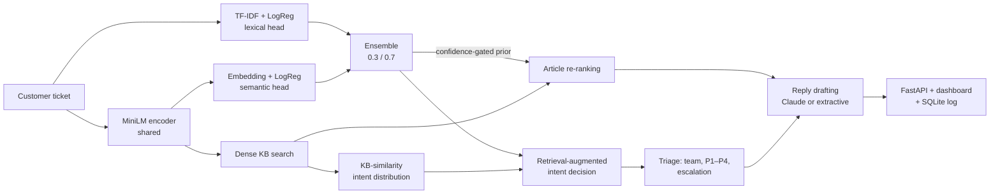

# SupportPilot

**AI triage and grounded reply drafting for customer-support tickets.**

SupportPilot reads an incoming customer message and, in ~50 ms (excluding the optional LLM call):

1. **Classifies the intent** (27 intents) with an ensemble of a TF-IDF model and a sentence-embedding model, augmented with evidence retrieved from the knowledge base.
2. **Triages** it: category, owning team, an explainable P1–P4 priority, and whether a human must take over.
3. **Retrieves** the relevant help-center articles with dense semantic search, re-ranked by the classifier.
4. **Drafts a reply** grounded in those articles with inline citations, using Claude (with PII redaction and prompt-injection fencing). It falls back to a deterministic offline drafter when no API key is set.

Everything ships as a FastAPI service with a web dashboard, a SQLite ticket log, tests, Docker and CI.


---

## Architecture



| Component | File | Notes |
|---|---|---|
| Text normalization | `src/supportpilot/text.py` | Maps dataset slots (`{{Order Number}}`) and real IDs (`#A-4821`) to the same token, so training and serving see the same inputs |
| Intent classifier | `src/supportpilot/classifier.py` | TF-IDF (word 1–2-grams + char 2–5-grams) and MiniLM-embedding logistic-regression heads, probability-averaged |
| Knowledge base | `data/kb/*.md` | 20 help-center articles for a fictional store; each declares the intents it answers |
| Retrieval | `src/supportpilot/retrieval.py` | BM25 (from scratch), dense index, weighted Reciprocal Rank Fusion, confidence-gated intent prior |
| Pipeline | `src/supportpilot/pipeline.py` | Retrieval-augmented classification → triage → retrieval → generation, with per-stage latency |
| Triage | `src/supportpilot/triage.py` | Transparent points system (urgency, legal threats, repeat contact, double charges, security, sentiment) |
| Generation | `src/supportpilot/generator.py` | Claude with citation validation, refusal handling and error fallbacks; offline extractive drafter |
| PII | `src/supportpilot/pii.py` | Redacts emails, phones, Luhn-valid cards, IBANs and SSNs before LLM calls and storage |
| API + UI | `src/supportpilot/api.py`, `static/index.html` | REST API, dashboard with queue analytics |

---

## Results

All numbers come from the scripts in `scripts/`, and the JSON reports are in `reports/`.

### 1. In-distribution accuracy is saturated, so I built a realistic test set

The [Bitext customer-support dataset](https://huggingface.co/datasets/bitext/Bitext-customer-support-llm-chatbot-training-dataset) has 26,872 utterances. It is templated, so after de-duplication (2,787 near-duplicates removed *before* splitting, to prevent leakage) every model scores about 99.8% on its test split. That number says little about production.

So I wrote **108 realistic tickets** (`data/eval/realistic_tickets.csv`, 4 per intent). They are longer and noisier than the training data, and include emotion, order numbers and phrasing that never appears in it. That set is where the models differ:

| Intent model | In-distribution test (n=2,409) | Realistic tickets (n=108) |
|---|---|---|
| TF-IDF + LogReg | 99.8% | 73.1% |
| MiniLM embeddings + LogReg | 99.6% | 82.4% |
| **Ensemble (0.3 TF-IDF + 0.7 embeddings)** | **99.8%** | **87.0%** |
| **+ retrieval-augmented classification** (production) | 99.9% | **90.7%** |

The TF-IDF model memorizes templates, and the embedding model generalizes. Averaging them keeps the typo-robustness of character n-grams: accuracy is 99.2% on the dataset's typo-flagged subset and 99.6% on the colloquial subset.

### 2. Retrieval-augmented classification closes training-data gaps

The data showed that *"I was charged twice"* never appears in the training data's `payment_issue` examples, so both classifier heads get it wrong. The KB, however, has a section titled *"Charged twice or charged for a failed order"*. The pipeline therefore turns KB-similarity scores into an intent distribution (a softmax over articles, split across each article's intents) and blends it with the classifier. The two parameters (blend 0.6, temperature 0.1) were tuned **only on the dev half** of the realistic set.

| Realistic tickets | Dev half (tuning) | **Test half (held out)** |
|---|---|---|
| Classifier only | 90.7% | 83.3% |
| + retrieval evidence | 94.4% | **87.0%** |

### 3. Retrieval: dense beats hybrid here, so I followed the data

The metric is article-level Recall@k and MRR. Relevance labels come from each article's declared intents.

| Method | In-dist R@1 | In-dist MRR | Realistic R@1 | Realistic R@3 | Realistic MRR |
|---|---|---|---|---|---|
| BM25 (implemented from scratch) | 43.4% | 0.579 | 67.6% | 85.2% | 0.771 |
| Dense (MiniLM) | 73.9% | 0.837 | 90.7% | 98.1% | 0.945 |
| Hybrid RRF (0.2 BM25 + 0.8 dense) | 71.7% | 0.823 | 88.0% | 99.1% | 0.932 |
| **Dense + confidence-gated intent prior** (production) | **85.2%** | **0.919** | **93.5%** | **99.1%** | **0.963** |

BM25 hurt on every split, including the validation grid search, so its fusion weight defaults to 0. It remains the fallback when the embedding model is unavailable (`SP_USE_DENSE=false`). The intent prior is **scaled by classifier confidence**, so an unsure classifier can't bury the right article. A version without gating scored about 2 points higher on average, but it pushed the correct answer out of the top 3 on out-of-coverage tickets like the double-charge example.

### 4. End-to-end system (realistic tickets, full pipeline)

| Metric | Value |
|---|---|
| Intent accuracy | 90.7% |
| Team routing accuracy | **99.1%** |
| Top retrieved article is correct | 93.5% |
| Auto-handled at threshold 0.4 | 72% of tickets, at **96.2%** accuracy |
| Escalated to a human (low confidence, P1, or asked for a human) | 31.5% |
| Latency, excluding the LLM (p50 / p95, CPU laptop) | ~40 ms / ~190 ms |

On the escalation threshold: on the dev half, 0.3 met a 95% accuracy target (89% automation). On the held-out half it dropped to 89.8%, because 54 examples is noisy. The default is the more conservative 0.4. It is a config value (`SP_CONFIDENCE_THRESHOLD`) and should be re-tuned on real traffic. The full trade-off curve is in `reports/pipeline_metrics.json`.

---

## Quickstart

```bash
git clone https://github.com/YOUR_USERNAME/supportpilot.git && cd supportpilot
python -m venv .venv && source .venv/bin/activate
make install        # dependencies
make train          # downloads the dataset (~19 MB), trains, writes reports/classifier_metrics.json
make eval           # retrieval + end-to-end benchmarks → reports/
make serve          # http://localhost:8000
```

Optional: enable Claude-drafted replies:

```bash
cp .env.example .env    # then set ANTHROPIC_API_KEY
```

Or with Docker (it trains at build time, so the image is self-contained):

```bash
docker compose up --build
```

## API

| Method | Endpoint | Description |
|---|---|---|
| `POST` | `/v1/tickets` | Full pipeline; stores the (redacted) ticket |
| `GET` | `/v1/tickets?limit=20` | Recent tickets |
| `GET` | `/v1/tickets/{id}` | One ticket with its full result |
| `POST` | `/v1/classify` | Intent only |
| `GET` | `/v1/search?q=…&k=3` | KB search |
| `GET` | `/v1/stats` | Escalation rate, averages, breakdowns by team, priority and intent |
| `GET` | `/health` | Active classifier, retrieval and generator modes |

Interactive docs are at `/docs`.

```bash
curl -s localhost:8000/v1/tickets -H 'Content-Type: application/json' \
  -d '{"text":"I was charged twice for order #A-4821!! Third time. Fix it or I file a chargeback."}'
```

```jsonc
{
  "intent": "payment_issue", "team": "Billing", "priority": "P1",
  "priority_reasons": ["intent 'payment_issue' (+3)", "urgency language (+2)", "legal / chargeback threat (+3)",
                       "repeat contact (+2)", "charged incorrectly (+2)", "negative sentiment (+1)"],
  "escalate": true, "articles": [{"id": "KB-011", "title": "Troubleshooting payment problems"}, ...],
  "reply": "Hi there, ... [KB-011] ... I've also passed your ticket to our Billing team ...",
  "latency_ms": {"classify": 38.1, "retrieve": 1.2, "generate": 0.4, "total": 39.7}
}
```

## LLM safety and reliability

- **Grounding:** the model may use only the retrieved excerpts, and must cite them as `[KB-xxx]`. Citations are validated against the retrieved set. Replies with no citation, or with a citation outside that set, are flagged `grounded: false` and escalated.
- **Prompt injection:** the ticket is passed as untrusted data inside `<ticket>` tags, and the system prompt tells the model to ignore instructions inside it.
- **Privacy:** PII is redacted before the API call, and the ticket log stores only redacted text.
- **Resilience:** authentication errors, rate limits, API errors, connection failures and model refusals all fall back to the extractive drafter. The pipeline never fails because of the LLM. Requests use server-side refusal fallbacks.

## Project structure

```
src/supportpilot/     application package (API, pipeline, models, retrieval, triage, generation)
scripts/              prepare_data · train_classifier · evaluate_retrieval · evaluate_pipeline
data/kb/              knowledge-base articles (markdown + front matter)
data/eval/            hand-labelled realistic tickets (out-of-distribution eval set)
reports/              generated metrics (JSON) and confusion matrix
tests/                23 unit + API tests (offline, no model download)
```

## Limitations and next steps

- The realistic eval set has 108 tickets, so differences of about 2 points are within noise. The next step is labelling a few hundred real tickets.
- The KB and store are fictional. In production the KB would sync from a help center such as Zendesk or Intercom.
- Grounding is enforced with citation checks. An LLM-as-judge faithfulness eval over drafted replies would be the next quality gate.
- The classifier is retrained offline. Agent corrections logged through the API would enable active learning.

## Data

The intent data comes from the Bitext Customer Support dataset (see its dataset card for license terms). It is downloaded by `scripts/prepare_data.py`, and a 405-row sample is included in `tests/fixtures/` for offline tests.

## License

MIT
